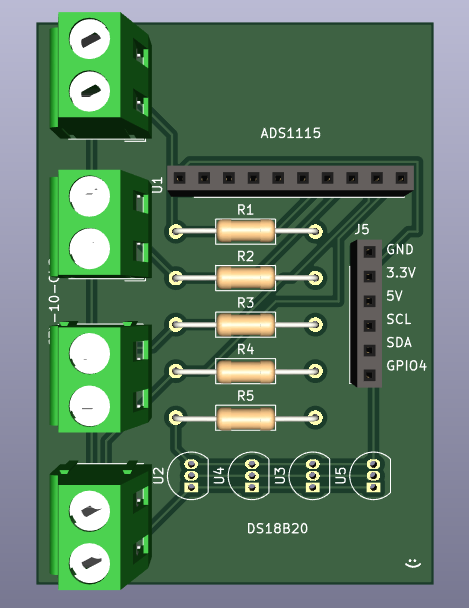

# Server Monitoring
A monitoring prometheus exporter for a server. Power and temperature values are exported in prometheus format via HTTP server. In addition, a webcam capture is taken every several seconds and saved within raspi for surveillance.

## Setup
Enable 1-Wire interface by adding the following line on config.txt, then reboot raspi.
```
$ sudo nano /boot/config.txt
[all]
dtoverlay=w1-gpio,pullup=on
$ reboot
```
Enable I2C interface:
Preferences -> Raspberry Pi Configuration -> Interfaces -> I2C (Enabled)

## Libraries
```
pip3 install threading
pip3 install cv2
pip3 install adafruit-blinka
pip3 install w1thermsensor
pip3 install prometheus_client
pip3 install adafruit-circuitpython-ads1x15
```

## Power Calculation
Several voltage data are collected to calculate RMS:

$$ RMS = \sqrt{\frac{1}{n}\Sigma_{i=1}^{n}{{V_i}^2}} $$

Then, Power consumption is calculated using the following method:

$$ Power = {V_O} * {RMS} * {n} / {R_L} $$
- R<sub>L</sub> = Resistance
- n = Number of Windings
- V<sub>O</sub> = Outlet Voltage
  
## Circuit

### Components
- Raspberry Pi 4B x1
- Logicool Webcam C270n x1
- ADS1115 x1
- CTL-10-CLS x4
- DS18B20 x4
- 1k Ohm Resistor x4
- 4.7k Ohm Resistor x1

### General Layout

Output voltage data from CTL-10-CLS is converted from analog to digital through ADS1115 and sent to raspi via I2C. Temperature data is directly sent from DS18B20 to raspi via 1-Wire. Frame data sent to raspi from webcam directly via USB.


### PCB

A simple PCB for mass production. Pin sockets and terminals used for expensive components. 1x10 pin socket for ADS1115, 1x6 pin socket for GPIO, and 1x2 terminals for CTL-10-CLS.

#### Schematic Diagram


#### PCB Diagram




## References

https://dolls.tokyo/post-11081/
https://www.souichi.club/raspberrypi/rasppi-ds18b20/
https://www.ishikawa-lab.com/RasPi_wattmeter.html
https://itnext.io/prometheus-building-a-custom-prometheus-exporter-in-python-988908327600

